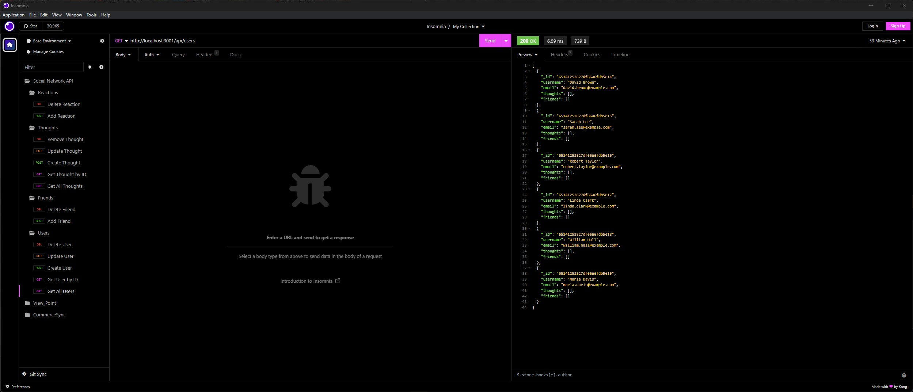

# LinkMate

## Table of Contents

- [Description](#description)
- [Live Screen Recording](#live-screen-recording)
- [Screenshots](#screenshots)
- [Technologies Used](#technologies-used)
- [Installation](#installation)
  - [Database Setup](#database-setup)
  - [Seeding](#seeding)
  - [Starting the server](#starting-the-server)
  - [Testing](#testing)
- [Features](#features)
- [Usage](#usage)
- [Contribution Guidelines](#contribution-guidelines)
- [License](#license)

## Description

The Social Network API is a backend application that empowers social networking platforms to manage user profiles, posts, and interactions seamlessly. Powered by MongoDB, a NoSQL database, this project ensures efficient data storage and retrieval for social networking functionalities.

Utilizing Mongoose, a MongoDB ODM (Object-Document Mapping) library, this API simplifies data manipulation, making it easier to organize and maintain various aspects of social networking data.

Developers and testers can employ tools like Postman to interact with the API endpoints, enabling operations such as user registration, post creation, and comment management within the social network platform.

## Live Screen Recording

Watch a live demonstration of the application's functionality [here](https://us04web.zoom.us/clips/share/BHVzMDQgMUcwqS350JhidpA8RkJy01NUYsjUr-WLfc3HjeZwATQ).

## Screenshots



## Technologies Used


- Dependencies: mongoose (v7.5.2), express (v4.17.1), nodemon (v2.0.3)
- Testing: Insomnia

## Installation

1. Clone the repository: `git clone https://github.com/MwangiR/LinkMate.git`
2. Open in VS Code. If not installed, [install VS Code](https://code.visualstudio.com/).
3. Install Node.js v16 (e.g., using npm: `npm i node@16`).
4. Install from package.json: `npm i`
5. To install dependencies independently:
   - mongoose: `npm i mongoose`
   - express: `npm i express@4.17.1`
   - nodemon: `npm i nodemon`

## Database Setup

Follow these steps to set up MongoDB for your project:

### 1. Install MongoDB

- Follow the MongoDB installation instructions for your OS: [MongoDB Installation Guide](https://docs.mongodb.com/manual/installation/).

### 2. Start MongoDB

- Launch the MongoDB server using the appropriate command for your system.

### 3. Configure Connection

- Ensure you have a `connection.js` file for MongoDB setup.
- Replace the connection string in `connection.js` with your MongoDB server details.

```javascript
// connection.js
const { connect, connection } = require('mongoose');

// Replace with your MongoDB connection string
connect('mongodb://127.0.0.1:27017/socialnetwork');

module.exports = connection;
```

### Seeding

1. Navigate to the root directory of the repository.
2. Run: `npm run seed` to seed the database and create table structures.

Now your database is populated with initial data and ready for testing.

### Starting the Server

1. With the terminal open in the root directory, run: `npm start` to start the server.
2. The server will start, and you'll see a message indicating that it's running.

### Testing

Once the server is up and running, you can test the functionality of the application using tools like [Insomnia](https://insomnia.rest/). Insomnia allows you to interact with the API routes you've set up in your application.

Here are a few example API routes you can test:

##### Users

- GET `/api/users`
- POST `/api/users`
- PUT `/api/users/:id`
- DELETE `/api/users/:id`

##### Thoughts

- GET `/api/thoughts`
- POST `/api/thoughts`
- PUT `/api/thoughts/:id`
- DELETE `/api/thoughts/:id`

##### Reactions

- POST `/api/thoughts/:thoughtId/reactions`
- DELETE `/api/thoughts/:thoughtId/reactions`

##### Friends

- POST `/api/users/:userId/friends/:friendId`
- DELETE `/api/users/:userId/friends/:friendId`

Make sure to replace `:id` with the actual IDs you want to interact with.

## Features

- Manage social network backend with Express routing.
- GET, POST, PUT, and DELETE routes for users, thoughts, reactions and friends.

## Usage

Interact with the database through API endpoints using tools like Insomnia or MySQL shell.

## Contribution Guidelines

- Open an issue for proposed changes.
- Create a feature branch for changes and wait for approval before merging.

## License

This project is licensed under the MIT License.
